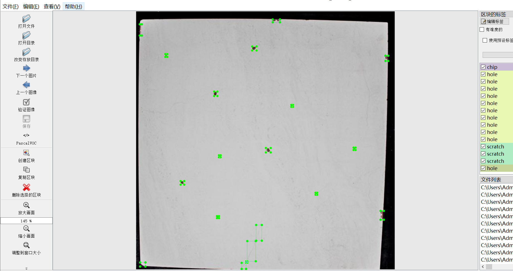
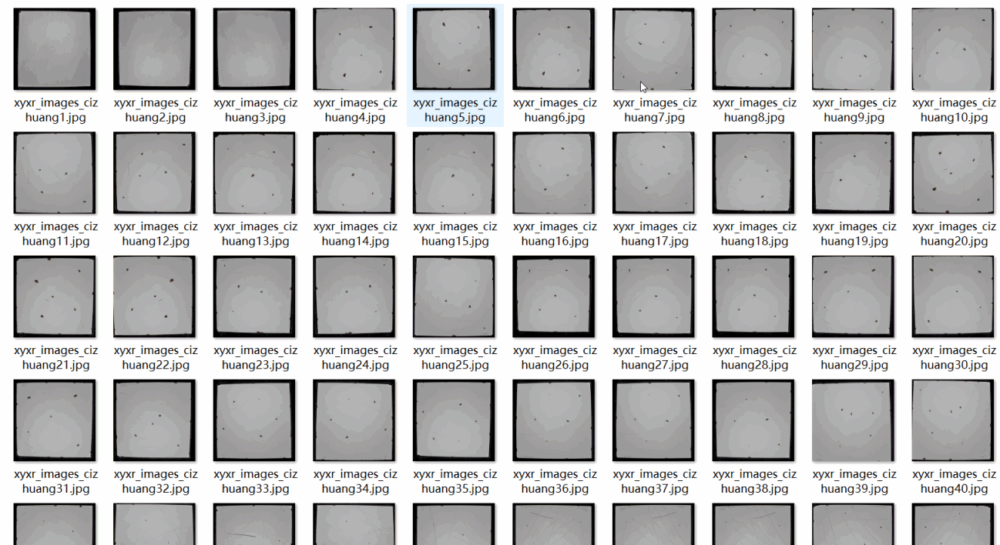
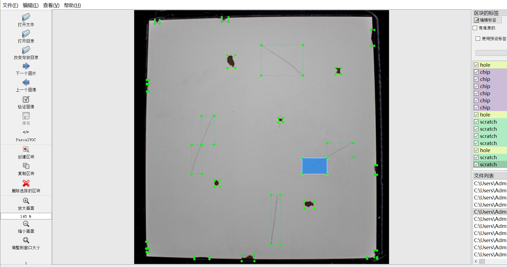
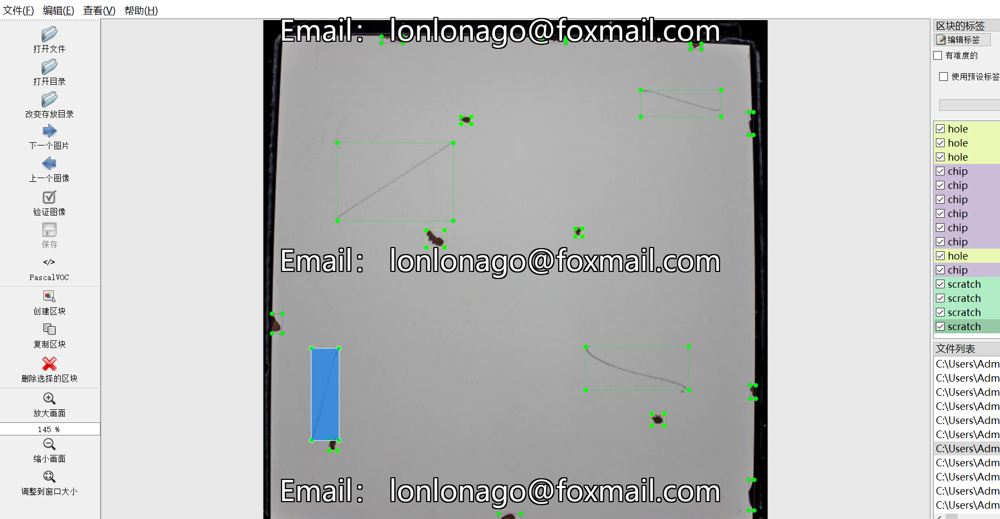

# [Object Detection] Paper Defect Detection Dataset

## Dataset Format: VOC + YOLO

### Compression Package Contents:
- 3 directories, each storing images, XML files, and TXT files.

JPEGImages directory contains a total of 2118 JPG images.

Annotations directory contains a total of 2118 XML files.

labels directory contains a total of 2118 TXT files.

Number of labels: 3

Label names: ["chip", "hole", "scratch"]

Box counts for each label (Note: the order in the YOLO format does not match this, but is based on the classes.txt in the Labels directory):

- chip boxes count = 14028 (gaps)

- hole boxes count = 14932 (holes)

- scratch boxes count = 10065 (scratches)

Total box count: 39025

Image resolution (pixels): Clear

Image enhancement status: No

Label shape: Rectangular boxes, used for target detection recognition

Important Notes: None available

Special Disclaimer: This dataset does not guarantee the accuracy or precision of any trained model or weight file. The dataset only provides accurate and reasonable annotations.

Annotation Example:

## Images

---

Here is a pay link on Stripe (https://buy.stripe.com/3cs8yP7sY87d0vu9AB). Please contact me lonlonago@foxmail.com after funding $89, and I will send you a complete data files, thank you!

